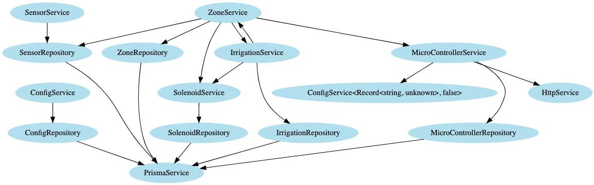

# What

This project analyses and produces a dependency map for projects using dependency injection through class arguments, ala NestJS (should work with Inversify too).

## Example visualisation



## Example JSON output

JSON is quite large for the above example, so scroll down to the bottom.

# Why

As a lightweight method to visualising dependency relationships. Ideally it also helps measure coupling and cohesion, for another time... maybe? probs not.

# How

This project uses the TypeScript compiler API (docs [here](https://github.com/microsoft/TypeScript/wiki/Using-the-Compiler-API)) to parse a given file. It navigates through the AST to build up a dependency map for all classes.

Once this is complete a map is generated which holds a list of dependencies for each class, and how many times the different methods on each of the dependencies is called.

This map is output at `module-map.json`.

The map is then used to generate a DOT file, this DOT file can be used to visualise the dependencies in a GraphViz visualisation tool.

# Getting Started

`yarn` to install dependencies

# Development

## Running

1. `yarn tsc --watch`
2. `node out/parser/parser.js $file-to-parse-here$`
   - i.e. `node out/parser/parser.js test-files/plant.ts`

## Config

Modify the config at `parser-config.ts`, currently it supports

- Ignoring classes

## Debugging

- modify the launch.json to target the file you want to parse
- press F5 to launch the debugger

# Viewing visualisations

Open the generated `module-graph.dot` file in http://viz-js.com/

# Viewing module map

Open the generate `module-map.json` file

# Example JSON Output

<details><summary>CLICK ME</summary>
<p>

```JSON
    {
      "PrismaService": {
        "dependencies": {},
        "dependents": {
          "MicroControllerRepository": "MicroControllerRepository",
          "ConfigRepository": "ConfigRepository",
          "SensorRepository": "SensorRepository",
          "SolenoidRepository": "SolenoidRepository",
          "ZoneRepository": "ZoneRepository",
          "IrrigationRepository": "IrrigationRepository"
        }
      },
      "PrismaModule": {
        "dependencies": {},
        "dependents": {}
      },
      "MicroController": {
        "dependencies": {},
        "dependents": {}
      },
      "MicroControllerRepository": {
        "dependencies": {
          "prisma": {
            "type": "PrismaService",
            "methods": {
              "controller": {
                "timesCalled": 3
              }
            }
          }
        },
        "dependents": {
          "MicroControllerService": "MicroControllerService"
        }
      },
      "MicroControllerService": {
        "dependencies": {
          "httpService": {
            "type": "HttpService",
            "methods": {
              "post": {
                "timesCalled": 1
              }
            }
          },
          "repository": {
            "type": "MicroControllerRepository",
            "methods": {
              "update": {
                "timesCalled": 1
              },
              "findById": {
                "timesCalled": 2
              }
            }
          },
          "config": {
            "type": "ConfigService<Record<string, unknown>, false>",
            "methods": {
              "get": {
                "timesCalled": 1
              }
            }
          }
        },
        "dependents": {
          "MicroControllerResolver": "MicroControllerResolver",
          "ZoneService": "ZoneService"
        }
      },
      "ControllerHeartbeatInput": {
        "dependencies": {},
        "dependents": {}
      },
      "Config": {
        "dependencies": {},
        "dependents": {}
      },
      "ConfigRepository": {
        "dependencies": {
          "prisma": {
            "type": "PrismaService",
            "methods": {
              "config": {
                "timesCalled": 1
              }
            }
          }
        },
        "dependents": {
          "ConfigService": "ConfigService"
        }
      },
      "ConfigService": {
        "dependencies": {
          "repository": {
            "type": "ConfigRepository",
            "methods": {
              "findById": {
                "timesCalled": 1
              }
            }
          }
        },
        "dependents": {
          "MicroControllerResolver": "MicroControllerResolver"
        }
      },
      "MicroControllerResolver": {
        "dependencies": {
          "microControllerService": {
            "type": "MicroControllerService",
            "methods": {
              "handleControllerHeartbeat": {
                "timesCalled": 1
              }
            }
          },
          "configService": {
            "type": "ConfigService",
            "methods": {
              "findById": {
                "timesCalled": 1
              }
            }
          }
        },
        "dependents": {}
      },
      "ConfigResolver": {
        "dependencies": {},
        "dependents": {}
      },
      "ConfigModule": {
        "dependencies": {},
        "dependents": {}
      },
      "MicroControllerModule": {
        "dependencies": {},
        "dependents": {}
      },
      "SensorReading": {
        "dependencies": {},
        "dependents": {}
      },
      "Sensor": {
        "dependencies": {},
        "dependents": {}
      },
      "SensorRepository": {
        "dependencies": {
          "prisma": {
            "type": "PrismaService",
            "methods": {
              "sensor": {
                "timesCalled": 1
              },
              "sensor_reading": {
                "timesCalled": 2
              }
            }
          }
        },
        "dependents": {
          "SensorService": "SensorService",
          "ZoneService": "ZoneService"
        }
      },
      "SensorService": {
        "dependencies": {
          "repository": {
            "type": "SensorRepository",
            "methods": {
              "findManySensorReadings": {
                "timesCalled": 1
              },
              "createReading": {
                "timesCalled": 1
              }
            }
          }
        },
        "dependents": {
          "SensorResolver": "SensorResolver"
        }
      },
      "SensorReadingInput": {
        "dependencies": {},
        "dependents": {}
      },
      "SensorResolver": {
        "dependencies": {
          "sensorService": {
            "type": "SensorService",
            "methods": {
              "getReadingsForSensor": {
                "timesCalled": 1
              },
              "createReading": {
                "timesCalled": 1
              }
            }
          }
        },
        "dependents": {}
      },
      "SensorModule": {
        "dependencies": {},
        "dependents": {}
      },
      "Solenoid": {
        "dependencies": {},
        "dependents": {}
      },
      "SolenoidRepository": {
        "dependencies": {
          "prisma": {
            "type": "PrismaService",
            "methods": {
              "solenoid": {
                "timesCalled": 5
              }
            }
          }
        },
        "dependents": {
          "SolenoidService": "SolenoidService"
        }
      },
      "SolenoidService": {
        "dependencies": {
          "solenoidRepository": {
            "type": "SolenoidRepository",
            "methods": {
              "update": {
                "timesCalled": 1
              },
              "findMany": {
                "timesCalled": 1
              },
              "findById": {
                "timesCalled": 1
              }
            }
          }
        },
        "dependents": {
          "SolenoidResolver": "SolenoidResolver",
          "ZoneService": "ZoneService",
          "IrrigationService": "IrrigationService"
        }
      },
      "SolenoidResolver": {
        "dependencies": {
          "solenoidService": {
            "type": "SolenoidService",
            "methods": {}
          }
        },
        "dependents": {}
      },
      "SolenoidModule": {
        "dependencies": {},
        "dependents": {}
      },
      "Zone": {
        "dependencies": {},
        "dependents": {}
      },
      "ZoneRepository": {
        "dependencies": {
          "prisma": {
            "type": "PrismaService",
            "methods": {
              "zone": {
                "timesCalled": 2
              }
            }
          }
        },
        "dependents": {
          "ZoneService": "ZoneService"
        }
      },
      "ZoneIrrigationListItem": {
        "dependencies": {},
        "dependents": {}
      },
      "ZoneIrrigationList": {
        "dependencies": {},
        "dependents": {}
      },
      "ZoneService": {
        "dependencies": {
          "repository": {
            "type": "ZoneRepository",
            "methods": {
              "findOne": {
                "timesCalled": 2
              },
              "findMany": {
                "timesCalled": 3
              }
            }
          },
          "microControllerService": {
            "type": "MicroControllerService",
            "methods": {
              "getControllerById": {
                "timesCalled": 1
              },
              "sendControllerMessage": {
                "timesCalled": 1
              }
            }
          },
          "sensorRepository": {
            "type": "SensorRepository",
            "methods": {
              "findMany": {
                "timesCalled": 1
              },
              "findManySensorReadings": {
                "timesCalled": 1
              }
            }
          },
          "solenoidService": {
            "type": "SolenoidService",
            "methods": {
              "findById": {
                "timesCalled": 1
              },
              "update": {
                "timesCalled": 1
              },
              "findMany": {
                "timesCalled": 3
              }
            }
          },
          "irrigationService": {
            "type": "IrrigationService",
            "methods": {
              "handleSolenoidOverride": {
                "timesCalled": 1
              }
            }
          }
        },
        "dependents": {
          "ZoneResolver": "ZoneResolver",
          "IrrigationService": "IrrigationService"
        }
      },
      "UpdateSolenoidInput": {
        "dependencies": {},
        "dependents": {}
      },
      "UpdateSolenoidFromClientInput": {
        "dependencies": {},
        "dependents": {}
      },
      "UpdateSolenoidFromMicroControllerInput": {
        "dependencies": {},
        "dependents": {}
      },
      "IrrigationJobsArgs": {
        "dependencies": {},
        "dependents": {}
      },
      "ZoneResolver": {
        "dependencies": {
          "zoneService": {
            "type": "ZoneService",
            "methods": {
              "getSensorsInZone": {
                "timesCalled": 1
              },
              "getSolenoidsInZone": {
                "timesCalled": 1
              },
              "getControllerForZone": {
                "timesCalled": 1
              },
              "getZoneById": {
                "timesCalled": 1
              },
              "getAllZones": {
                "timesCalled": 1
              },
              "getIrrigationSummary": {
                "timesCalled": 1
              },
              "updateSolenoid": {
                "timesCalled": 2
              }
            }
          },
          "irrigationService": {
            "type": "IrrigationService",
            "methods": {
              "getIrrigationJobsForZone": {
                "timesCalled": 1
              }
            }
          }
        },
        "dependents": {}
      },
      "ZoneModule": {
        "dependencies": {},
        "dependents": {}
      },
      "IrrigationJob": {
        "dependencies": {},
        "dependents": {}
      },
      "IrrigationRepository": {
        "dependencies": {
          "prisma": {
            "type": "PrismaService",
            "methods": {
              "irrigation_job": {
                "timesCalled": 4
              }
            }
          }
        },
        "dependents": {
          "IrrigationService": "IrrigationService"
        }
      },
      "IrrigationService": {
        "dependencies": {
          "repository": {
            "type": "IrrigationRepository",
            "methods": {
              "findManyJobs": {
                "timesCalled": 3
              },
              "markJobsAsInactive": {
                "timesCalled": 2
              },
              "getActiveJobs": {
                "timesCalled": 1
              },
              "createManyJobs": {
                "timesCalled": 1
              }
            }
          },
          "solenoidService": {
            "type": "SolenoidService",
            "methods": {
              "findMany": {
                "timesCalled": 1
              }
            }
          },
          "zoneService": {
            "type": "ZoneService",
            "methods": {
              "getManyZones": {
                "timesCalled": 1
              },
              "updateAllSolenoidsInZone": {
                "timesCalled": 2
              },
              "getAllZones": {
                "timesCalled": 1
              },
              "getRecentSensorReadingsForZone": {
                "timesCalled": 1
              }
            }
          }
        },
        "dependents": {
          "ZoneService": "ZoneService",
          "ZoneResolver": "ZoneResolver"
        }
      },
      "IrrigationModule": {
        "dependencies": {},
        "dependents": {}
      },
      "AppModule": {
        "dependencies": {},
        "dependents": {}
      }
    }
```

</p>
</details>
